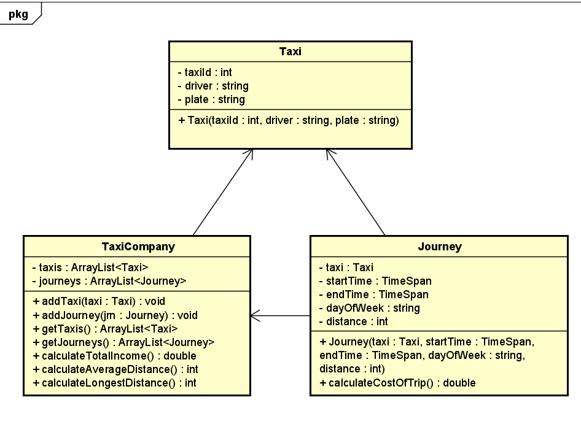

# Startdocument for  Taxi prices

Startdocument of **Miroslav Penchev**. Student number **4998960**.

## Problem Description

A taxi company owns a number of taxis and operates the following prices: 
€ 0.50 per kilometre driven. An additional € 0.17 for each minute driven. A 15% 
surcharge applies from 10 pm on Friday evening until 7.00 am on Monday 
morning (determined by the start time). 
A program must be developed in which the start and end time (format hhmm) 
and the day of the week and the distance can be entered for each taxi journey. 
The payable amount for each journey must be calculated and shown. The total 
income, the average distance and the longest distance must also be shown 
cumulatively.

### Input & Output

In this section the in- and output of the application will be described.

#### Input

In the table below all the input (that the user has to input in order to make the application work) are described.

|Case|Type|Conditions|
|----|----|----------|
|Number of the taxi|`int`|`taxiID` > 0|
|Name Of driver|`String` |not empty|
|Plate of taxi|`String`|not empty|
|Beginning time of trip|`TimeSpan`|not empty|
|Ending time of trip|`TimeSpan`|not empty|
|Day of the week|`String`|not empty|
|Distance traveled(in kilometer)|`int`|`distance` > 0|
|Registering a new taxi to the company|`Taxi`|not empty|
|Registering a new journey in the company|`Journey`|not empty|

#### Output

|Case|Type|
|----|----|
|The cost of a single journey |`double`|
|Average distance of all the journeys |`int`|
|LOngest distance amongst all the journeys |`int`|
|Total income of the company |`double`|
|All registered taxis in the company|`ArrayList<Taxi>`|
|All journeys made so far|`ArrayList<JOurney>`|

#### Remarks

* Unit Tests will be provided.

## Class Diagram

## Testplan

In this section the testcases will be described to test the application.

### Test Data

In the following table you'll find all the data that is needed for testing.

#### Taxi

| ID            | Input                                           | Code                                                 |
| ------------- | ----------------------------------------------  | ---------------------------------------------------- |
| `taxi1`       |  TaxiId: 1 driver: Jeff plate: MRPL8S | `Taxi taxi1 = new Taxi(1, "Jeff", "MRPL8S")`         |
| `taxi2`       |  TaxiId: 2 driver: Mark plate: MKR0GT | `Taxi taxi2 = new Taxi(2, "Mark", "MKR0GT")`         |

#### Journey

| ID            | Input                                           | Code                                                 |
| ------------- | ----------------------------------------------  | ---------------------------------------------------- |
| `jrn1`        |  Taxi: taxi1 startTime: 10:45 endTime: 11:15 day: Tuesday distance : 22km | `Journey jrn1 = new Taxi(taxi1, 10:45, 11:15, Tuesday, 22) `         |
| `jrn2`        |  Taxi: taxi2 startTime: 22:50 endTime: 00:00 day: Friday distance : 77km | `Journey jrn2 = new Taxi(taxi2, 22:50, 00:00, Friday, 77) `         |

#### Taxi Company

| ID           | Input | Code          |
| ------------ | ----- | --------------|
| `taxiComp`   |       | `TaxiCompany taxiComp = new TaxiCompany()`  |

#### Add taxis and journeys to the depo

| Taxi Company         | Code                      |
| ------------ | ------------------------- |
| `taxiComp`     | `addTaxi(taxi1)`        |
| `taxiComp`     | `addJourney(jrn2)`           |
| `taxiComp`     | `addTaxi(taxi2)`        |
| `taxiComp`     | `addJourney(jrn1)`           |

### Test Cases

In this section the testcases will be described. Every test case should be executed with the test data as starting point.

#### #1 Calcualate the cost of the trip

Testing the method to calcualte the cost of a specific trip

|Step|Input|Action|Expected output|
|----|-----|------|---------------|
|1|`jrn1.calculateCostOfTrip()`||`16.10`||
|2|`jrn2.calculateCostOfTrip()`||`57.96`||

#### #2 Calculate Average Distance/Longest Distance/Total Income

(We follow this based on the things made in the first test case)

|Step|Input|Action|Expected output|
|----|-----|------|---------------|
|1|`taxiComp.calculateTotalIncome()`||`74.06`||
|2|`taxiComp.calculateAverageDistance()`|| `49.5` ||
|3|`taxiComp.calculateLongestDistance()`||`77`||

